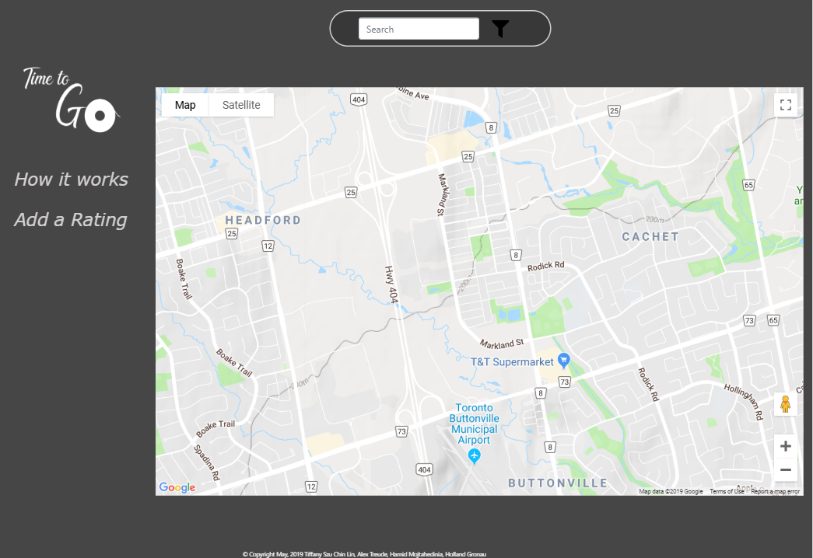
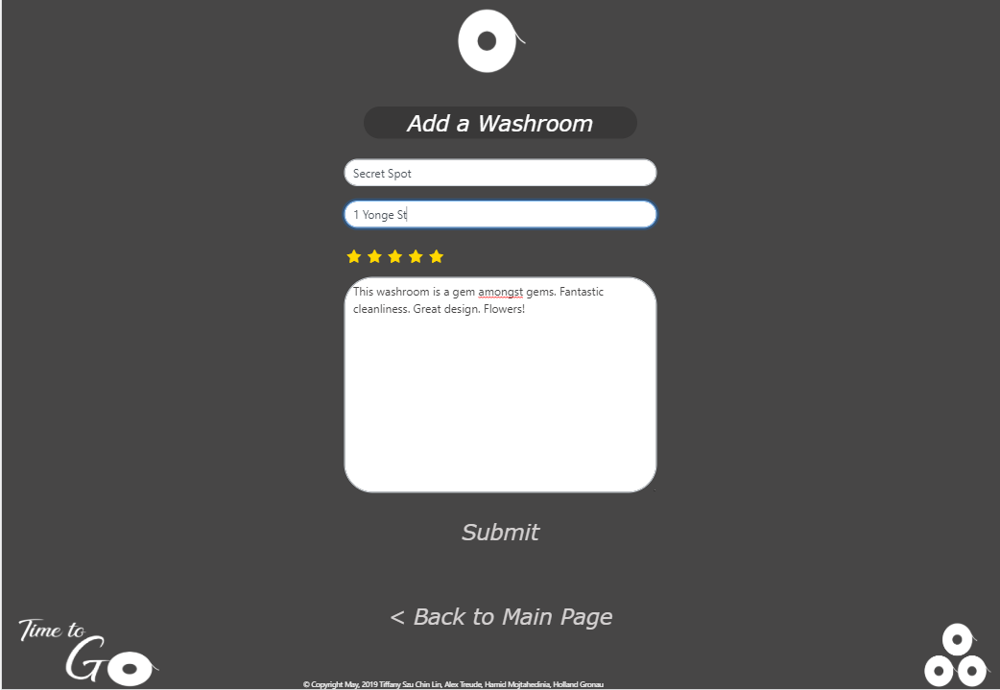
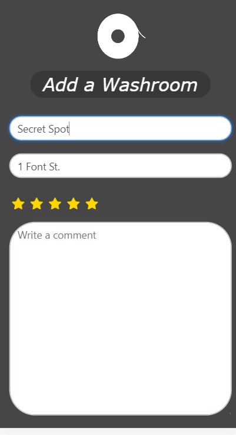
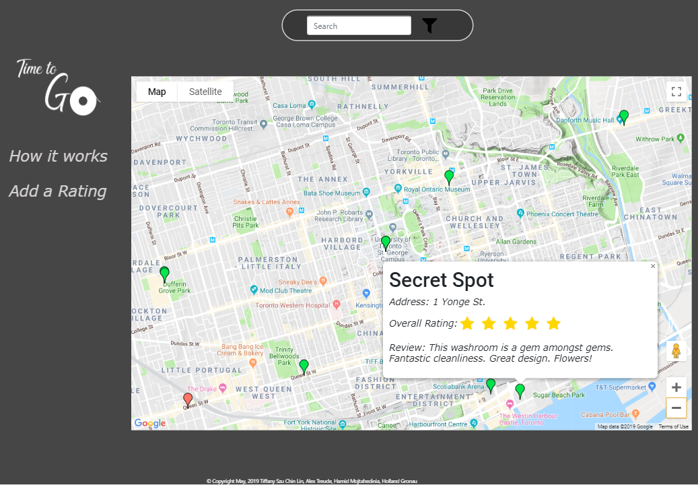
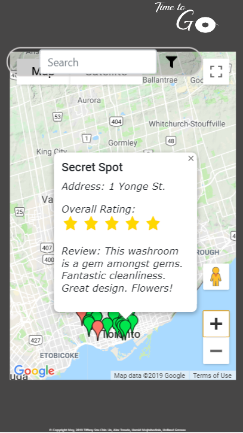
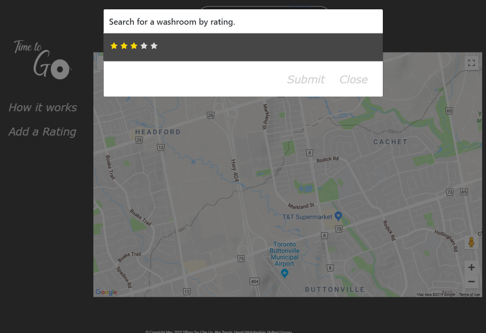
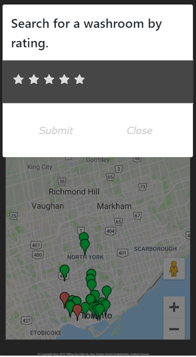
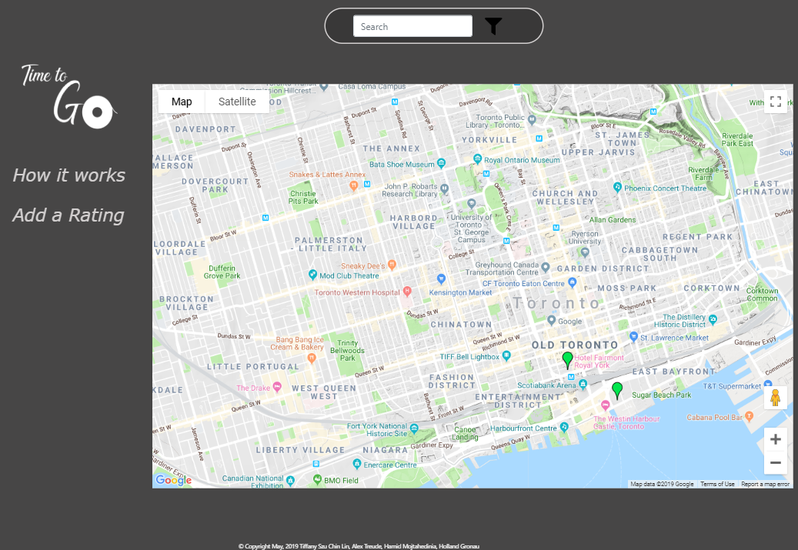
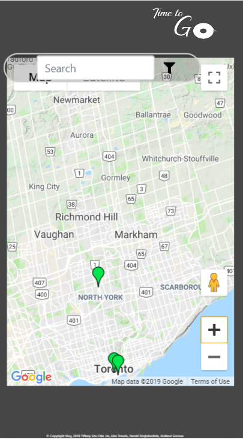

# Time to Go TO

Time to Go is the quickest, simplest way of finding an amazing public washroom near you when nature calls. The app's map shows the public toilets closest to you that have been submitted and reviewed by other users. Green means good to go. Red means proceed with caution. And, if you need to know all the details, touch each map point for a full review. Have a throne you love to worship? Please add it. We're all in this together!

## Live Site
https://limitless-retreat-50315.herokuapp.com/

## Technologies and Frameworks
* Google Maps JavaScript API
* Node.js
* Express
* Handlebars
* mySQL
* Sequelize
* Axios
* Heroku
* JawsDB
* REST API Principals
* JavaScript
* Bootstrap
* jQuery
* HTML
* CSS
* SASS

### Demo

Our app is responsive to various devices. When you first launch our app, you will be direct to the main page. 
      

To add a washroom, simply click  "Add a Rating" and complete all the fields. 
      

You will then find your washroom added to our databse and displayed on on the map. 
      

There is an option to search for washroom in our database based on it's overal rating. To do so, click on the filter icon on the side of the search bar and select a star of your rating. 
      

Our app will then return all washrooms that match the user's specification. 
      

## Authors
* **Alex Treude**         [Treudey](https://github.com/Treudey)
* **Tiffany Lin**         [Tiffolin](https://github.com/Tiffolin)
* **Hamid Mojtahedinia**  [hmojtahedinia](https://github.com/hmojtahedinia)
* **Holly Gronau**        [OtakuToronto](https://github.com/OtakuToronto)

## License
MIT

